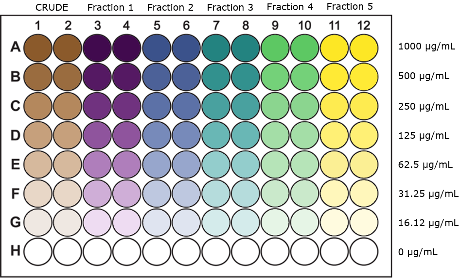

## To Do list:

* Finish expounding on the madness.
* Add "early_auc" column in which doesn't take into account the final measurement (24h for fast bois, 72h for slow bois).
* Incorporate pure compound MIC data.
* Incorporate use of the Google Doc so we can see a summary based on a extract code or ICMP numbuh.

# How to use:

1.  Run all chunks.
    + This will automatically create two dated tidy files - one with the raw lux data, and one with the auc-transformed data.
2.  Use plot_extract_auc("extract_name"") or plot_fraction_auc("extract_name"", fraction) to visualise extract activity.

e.g. Use plot_extact_auc("SV1_42") to view the activity of all fractions of SV1-42 at 1 mg/mL. Use  plot_extact_auc("SV1_42", 5) to view the activity of fraction 5 of SV1-42 at all concentrations tested.

# Summary:

The code below automatically uses the raw .xls output files from the Victor plate reader [in the "data" subfolder] to generate two tidy .csv files ["lux_data" and "auc_data"]. The latter file can then be used to generate plots that show the activity of:

1.  The crude extract and each extract fraction [plot_extract_auc()], or 
2.  The activity of one extract fraction at all concentrations tested[plot_fraction_auc()].

A full description of the methods are available in the "documents" subfolder. In summary:

* Dissolved crude fungal extracts and their 5 fractions are diluted to a concentration of 1 mg/mL in the top row of a 96-well plate. Each is tested in duplicate.  
* These are serially diluted [1-in-2] down the 96-well plate until the second-to-last row. The last row is left extract-free.  
* Bioluminescent bacteria are added to all wells.  
* The luminescence in each well is measured in the Victor plate reader [t = 0].  
* The plate is incubated at the appropriate temperature in an incubator.  
* The luminescence is re-measured in each well at suitable time-points. These time-points that luminescence is measured are different for different bacteria.  
* The output files from the Victor plate reader containing all the luminescence measurements are renamed and transferred to the "data" subfolder for analysis.  
    

    
The filenames follow the following format:   [date]\_[researcher]\_[measurement_type]\_[screening_round]\_[compound]\_[organism]\_[biological_rep]\_[time_point].xls

  * [date] describes the date of the plate measurement in YYYYMMDD format.
  * [researcher] describes the initials of the person making the measurement.
  * [measurement_type] describes what kind of measurement the plate reader is taking. In this case the type of measurement is always "MICLux" [luminescence].
  * [screening_round] describes the particular round of screening a plate belongs to. This number is used to link extracts that were tested at the same time using the same bacterial culture, as well as the associated control plate for that round of screening.
  * [compound] describes the chemistry code assigned to the set of extracts that are being tested. These generally have the format [researcher][book]-[number], e.g. SV1-10.
  * [organism] describes the bacterium being tested. Initials for each bacterium are used - e.g. EC for *Escherichia coli*.
  * [biological_rep] describes the biological replicate for each bacterial culture. Extracts will be tested using at least 2 different cultures cultured on different days as long as we receive enough extract to do so.
  * [time_point] describes the time of measurement after inoculation of bacteria, in hours.
  
Example filename: 20180822\_SV\_MIClux\_6\_MC10-102\_EC\_1\_0.xls

# Code:

Install required packages:
```{r, setup, message=FALSE, warning=FALSE}
if(!require(readxl)) {
  install.packages(c("readxl")); 
  require(readxl)
  } #load / install+load readxl package

if(!require(tidyverse)) {
  install.packages(c("tidyverse")); 
  require(tidyverse)
  } #load / install+load tidyverse package

if(!require(viridis)) {
  install.packages(c("viridis")); 
  require(viridis)
  } #load / install+load viridis package
```

Collect info from each of the filenames in the data subfolder:
```{r, filename_vars}
extract_data <- function(filename) {
  filename_vars <- strsplit(filename, "_", fixed = TRUE)[[1]] 
  filename_vars[8] <- strsplit(filename_vars[8], ".", 
                               fixed = TRUE)[[1]][1]
  filename_vars <- c(filename, filename_vars[1:8]) #Adds the whole filename to the beginning of the vector
  return(filename_vars)
}
data_filenames <- list.files(path = "data/", pattern = "*.xls")
filename_vars_list <- lapply(data_filenames, extract_data)
```

The plates are always set up in the same way:
Each extract plate tests a maximum concentration of 1 mg/mL in duplicate:

*  Columns 1 & 2 measure the activity of the crude extract.
*  Columns 3 & 4 measure the activity of fraction 1.
*  Columns 5 & 6 measure the activity of fraction 2.
*  Columns 7 & 8 measure the activity of fraction 3.
*  Columns 9 & 10 measure the activity of fraction 4.
*  Columns 11 & 12 measure the activity of fraction 5.
*  The last row of the plate (row H) contains no extract.

Each control plate contains DMSO (the extract solvent), an antibiotic (positive control), and a broth control:

*  Columns 1 & 2 measure the activity of DMSO, starting at 4% v/v.
*  Columns 3 & 4 measure the the activity of rifampicin. The starting concentration depends on the organism tested.
*  Columns 5 & 6 measure the luminescence of broth without any bacteria.

Define the maximum concentration of antibiotic tested against each organism in their respective control plates:
```{r, max_antibiotic_concs}
# May be subject to change going forward...
max_antibiotic_concs <- tribble(
  ~organism,    ~antibiotic, ~max_concentration, ~bg_auc,
       "AB", "Erythromycin",               1000,      24,
       "EC",    "Kanamycin",               1000,      24,
       "KP",    "Kanamycin",               1000,      24,
       "MS",   "Rifampicin",                 10,     576,
       "MA",   "Rifampicin",               1000,     576, 
       "MM",   "Rifampicin",                 10,     576, 
       "PA",    "Kanamycin",               1000,      24, 
       "sA", "Erythromycin",               1000,      24
)
max_extract_conc <- 1000
```

Set up serial dilution function for concentration column in the tidy file:
```{r, serial_dilution}
serial_dilution <- function(initial_concentration, n_test_columns) {
  well <- 1
  concentrations <- c(initial_concentration)
  while (well < n_test_columns){
    concentrations <- c(concentrations, initial_concentration / (2 ^ well)) 
    well <- well + 1
  }
  concentrations <- append(concentrations, 0)
  return(concentrations)
}
```

Tidy up data:
```{r, tidy_up}
tidy_up_extract <- function(filename_vars) { # For plates containing extracts
  data_file <- read_excel(path = paste("data/", filename_vars[1], sep = ""), sheet = 1)
  col_layout <- rep(c("CRUDE", as.character(1:5)),
                    each = 2)
  extract_concentrations <- serial_dilution(max_extract_conc, 7)
  tidy_sheet <- as_tibble(data.frame(
    date = rep(filename_vars[2], times = nrow(data_file)),
    researcher = rep(filename_vars[3], times = nrow(data_file)),
    screening_round = rep(filename_vars[5], times = nrow(data_file)),
    extract = rep(filename_vars[6], times = nrow(data_file)),
    extract_fraction = rep(col_layout, times = nrow(data_file) / length(col_layout)),
    concentration = c(rep(extract_concentrations[1], times = length(col_layout)),
                      rep(extract_concentrations[2], times = length(col_layout)),
                      rep(extract_concentrations[3], times = length(col_layout)),
                      rep(extract_concentrations[4], times = length(col_layout)),
                      rep(extract_concentrations[5], times = length(col_layout)),
                      rep(extract_concentrations[6], times = length(col_layout)),
                      rep(extract_concentrations[7], times = length(col_layout)),
                      rep(extract_concentrations[8], times = length(col_layout))
                      ),
    organism = rep(filename_vars[7], times = nrow(data_file)),
    biological_rep = rep(filename_vars[8], times = nrow(data_file)),
    technical_rep = rep(c(1, 2), times = nrow(data_file) / 2),
    time_point = rep(filename_vars[9], times = nrow(data_file)),
    luminescence = data_file[,6, drop = TRUE],
    stringsAsFactors = FALSE
    )
  )
  return(tidy_sheet)
}

tidy_up_ctrl <- function(filename_vars) { # For plates containing controls
  data_file <- read_excel(path = paste("data/", filename_vars[1], sep = ""), sheet = 1)
  antibiotic <- filter(max_antibiotic_concs, 
                                organism == filename_vars[7]
                                )[[2]]
  top_antibiotic_conc <- filter(max_antibiotic_concs, 
                                organism == filename_vars[7]
                                )[[3]]
  col_layout <- rep(c("DMSO", antibiotic, "Broth"),
                    each = 2)
  antibiotic_concentrations <- serial_dilution(top_antibiotic_conc, 7)
  dmso_concentrations <- serial_dilution(4, 7)
  broth_concentrations <- serial_dilution(1, 7) # Not set to 0 to allow rows to be identified by different keys.
  tidy_sheet <- as_tibble(data.frame(
    date = rep(filename_vars[2], times = nrow(data_file)),
    researcher = rep(filename_vars[3], times = nrow(data_file)),
    screening_round = rep(filename_vars[5], times = nrow(data_file)),
    extract = rep(filename_vars[6], times = nrow(data_file)),
    extract_fraction = rep(col_layout, times = nrow(data_file) / length(col_layout)),
    concentration = c(rbind(dmso_concentrations,
                            dmso_concentrations,
                            antibiotic_concentrations,
                            antibiotic_concentrations,
                            broth_concentrations,
                            broth_concentrations
                           )
                      ),
    organism = rep(filename_vars[7], times = nrow(data_file)),
    biological_rep = rep(filename_vars[8], times = nrow(data_file)),
    technical_rep = rep(c(1, 2), times = nrow(data_file) / 2),
    time_point = rep(filename_vars[9], times = nrow(data_file)),
    luminescence = data_file[,6, drop = TRUE],
    stringsAsFactors = FALSE
    )
  )
  return(tidy_sheet)
}

tidy_up <- function(filename_vars) {
  if (filename_vars[6] == "CTRL") {
    tidy_up_ctrl(filename_vars)
  }
  else {
     tidy_up_extract(filename_vars)
  }
}

lux_tidy <- bind_rows(lapply(filename_vars_list, tidy_up)) %>% 
  mutate(screening_round = paste(researcher, screening_round,
                                 sep = ""))
colnames(lux_tidy)[11] <- "luminescence"
lux_tidy$organism <- as.factor(lux_tidy$organism)
lux_tidy$extract_fraction <- factor(lux_tidy$extract_fraction,
  levels = levels(as.factor(lux_tidy$extract_fraction))
    [c(7, 1:6, 8:nlevels(as.factor(lux_tidy$extract_fraction)))],
  ordered = TRUE) # ordering of levels for later plotting
lux_tidy$time_point <- as.numeric(lux_tidy$time_point) # Prevents NaNs in AUC calc.
```

Some lanes didn't contain any extract due to limited extract availability or contamination of inoculated cultures. These lanes need to be removed individually. The following code constructs a phrase which is used to filter out lanes that were measured but didn't have any extract. These "missing lanes" are documented in "missing_lanes.csv" in the main directory.
```{r, missing_lanes, message=FALSE}
missing_lanes <- read_csv(file = "missing_lanes.csv") %>% 
  select(-date) %>% 
  mutate(screening_round = paste(researcher,
                                 screening_round,
                                 sep = "")
  )
missing_lanes[is.na(missing_lanes)] <- FALSE

clean_rownames <- colnames(missing_lanes)[6:17] %>% 
    str_remove_all("fraction") %>%
    str_split(pattern = "_") %>%
    as.data.frame() %>%
    t() %>%
    as_tibble()

# Construct individual phrases for each extract plate with missing lanes.
filter_phrases_df <- tibble(
  screening_round = rep(missing_lanes$screening_round,
                        each = 12
                        ),
  extract = rep(missing_lanes$extract,
                        each = 12
                ),
  biological_rep = rep(missing_lanes$biological_rep,
                        each = 12
                       ),
  organism = rep(missing_lanes$organism,
                        each = 12
                 ),
  fraction = rep(clean_rownames$V1, times = nrow(missing_lanes)
                 ),
  technical_rep = rep(clean_rownames$V2, times = nrow(missing_lanes)
                      ),
  lane_is_missing = missing_lanes %>% 
    select(6:17) %>%
    t() %>% 
    as.vector()
  ) %>% 
  filter(lane_is_missing) %>% 
  mutate(filter_phrase = paste(
    "!(screening_round == '", screening_round,
    "' & extract == '", extract,
    "' & biological_rep == '", biological_rep,
    "' & organism == '", organism,
    "' & extract_fraction == '", fraction,
    "' & technical_rep == '", technical_rep,
    "')", sep = ""
  ))

# Combine filter phrases
big_filter_phrase <- filter_phrases_df %>% 
  select(filter_phrase) %>% 
  unlist() %>% 
  paste(collapse = " & ")

# Filter out missing lanes
corrected_tidy_file <- lux_tidy %>% 
  filter(
    eval(str2expression(big_filter_phrase))
  )
```

Save the new tidy file:
```{r, write_lux}
# Returns the current date in YYYYMMDD format.
get_date <- function(){ 
  date <- as.character(Sys.Date())
  date <- gsub("-", "", date)
  return(date)
}

# Construct filename for tidy data sheet for raw lux values.
tidy_filename <- paste(get_date(), 
                       filename_vars_list[[1]][3], 
                       filename_vars_list[[1]][4],
                       "mic_tidy", 
                       sep = "_"
                       )

write_csv(corrected_tidy_file, path = paste("data_output/", tidy_filename, ".csv", sep = ""))
```

Area Under Curve (AUC) transformation of luminescence data, and calculate reduction in AUC compared to controls:
```{r, calc_auc}
# Previous caTools::trapz() function doesn't work when the total number of time points for each AUC calculation aren't equal throughout the data frame. This modified versioun works though :).
calculate_auc <- function(x, y) {
  x <- sort(x)
  idx = 2:length(x)
  var1 = as.numeric(x[idx]) - as.numeric(x[idx-1])
  var2 = as.numeric(y[idx]) + as.numeric(y[idx-1])
  return (as.double(var1 %*% var2 / 2))
}

# AUC calcs
auc_data <- corrected_tidy_file %>% 
  select(-date) %>% 
  group_by(researcher, screening_round, extract, 
           extract_fraction, concentration, organism, 
           biological_rep, technical_rep) %>% 
  summarise(auc = calculate_auc(x = time_point,
                                y = luminescence)
            )


# Calculate log-reduction in AUC compared to negative controls:
ctrl_auc <- auc_data %>% 
  filter(concentration == 0, extract_fraction != "BROTH") %>% 
  ungroup() %>% 
  select(screening_round, organism, auc) %>% 
  group_by(screening_round, organism) %>% 
  summarise(median_ctrl_auc = median(auc))
auc_data <- auc_data %>% 
  left_join(ctrl_auc, by = c("screening_round", "organism"))

# Replace AUC values of 0 with 1 to prevent NaNs produced during log-reduction calculation.
auc_data$median_ctrl_auc <- replace(auc_data$median_ctrl_auc, 
                                    auc_data$median_ctrl_auc == 0, 
                                    1)
auc_data$auc <- replace(auc_data$auc, 
                        auc_data$auc == 0, 
                        1)


auc_data <- auc_data %>% 
  mutate(log_reduction_auc = -log10(auc / median_ctrl_auc)) 
```

Save AUC data file:
```{r, write_auc}
auc_filename <- paste(get_date(), 
                      filename_vars_list[[1]][3], 
                      filename_vars_list[[1]][4], 
                      "auc_tidy", 
                      sep = "_"
                      )

write_csv(auc_data, path = paste("data_output/", auc_filename, ".csv", sep = ""))
```

Prepare colour palette for plots:
```{r, palette}
extract_palette <- tibble(
  fraction = c("CRUDE", as.character(1:5)),
  colours = c("tan4", "#440154FF", "#3B528BFF", 
              "#21908CFF", "#5DC863FF", "#FDE725FF")
)
facet_labels <- c(
  AB = "A. baumannii",
  EC = "E. coli",
  KP = "K. pneumoniae",
  MA = "M. abscessus",
  MM = "M. marinum",
  MS = "M. smegmatis",
  PA = "P. aeruginosa",
  SA = "S. aureus"
)
```

Function for plotting the activity of the crude extract and the extract fractions at 1 mg/mL:
```{r, extract_plot}
plot_extract_auc <- function(extract_to_plot) {
  screening_rounds <- auc_data %>% 
    filter(extract == extract_to_plot) %>% 
    pull(screening_round) %>% 
    as.factor() %>% 
    levels()

  control_median_auc <- auc_data %>% # Calculate the median negative ctrl
    filter(screening_round %in% screening_rounds,
           concentration == 0,
           extract_fraction != "Broth"
           ) %>% 
    ungroup() %>% 
    select(organism, auc) %>% 
    group_by(organism) %>% 
    summarise(median_auc = median(auc)) %>% 
    droplevels.data.frame()
  
  plot_title <- paste(extract_to_plot, "Extract Activity at 1 mg/mL")
  
  data_to_plot <- auc_data %>% 
    filter(extract == extract_to_plot, 
           concentration == 1000
    ) %>% 
    droplevels.data.frame()
  
    ggplot(data_to_plot,
           aes(x = extract_fraction, 
               y = auc, 
               fill = extract_fraction)) +
      geom_boxplot() +
      geom_hline(data = filter(max_antibiotic_concs, 
                          organism %in% data_to_plot$organism),
                 aes(yintercept = bg_auc),
                 linetype = "dashed") +
      geom_hline(data = control_median_auc,
                 aes(yintercept = median_auc)) +
      scale_y_log10(breaks = c(10^1, 10^2, 10^3, 10^4, 10^5, 10^6),
                    minor_breaks = NULL,
                    labels = c(expression (10^1),
                               expression (10^2),
                               expression (10^3),
                               expression (10^4),
                               expression (10^5),
                               expression (10^6)
                               ),
                    limits = c(10^1, 10^6)
                    ) +
      scale_fill_manual(values = extract_palette$colours) +
      labs(x = "Extract Fraction",
           y = "Area Under Curve\n(Luminescence \U00B7 Time)",
           title = plot_title,
           fill = "Extract Fraction") +
      facet_grid(. ~ organism, 
                 labeller = labeller(organism = facet_labels)) +
      theme_bw() +
      theme(strip.text = element_text(face = "italic")) +
      annotation_logticks(sides = "l")
}

extract_names <- auc_data %>% 
  pull(extract) %>% 
  unique()

get_auc_plot_filename <- function(extract_name) {
  paste(extract_name, "auc_boxplot.png", sep = "_")
}

plot_extract_auc("SV1-42") # Example
```
Solid upper black line shows median AUC (luminescence over time) of each bacterium in absence of any extract. Dashed lower black line shows median AUC of broth only (no bacteria). The data sets used to calculate these control values have been limited to screening rounds in which the selected extract was tested.

Plot the AUC values of a single extract fraction over all concentrations:

```{r, fraction_plot}
plot_fraction_auc <- function(extract_to_plot, fraction_to_plot) {
  screening_rounds <- auc_data %>% 
    filter(extract == extract_to_plot) %>% 
    pull(screening_round) %>% 
    as.factor() %>% 
    levels()

  control_median_auc <- auc_data %>% 
    filter(screening_round %in% screening_rounds,
           concentration == 0,
           extract_fraction != "BROTH"
           ) %>% 
    ungroup() %>% 
    select(organism, auc) %>% 
    group_by(organism) %>% 
    summarise(median_auc = median(auc))
  
  plot_title <- paste(extract_to_plot, "Fraction", fraction_to_plot, "Extract Activity")
  plot_colour <- extract_palette %>% 
    filter(fraction == fraction_to_plot) %>% 
    .$colours
  
  data_to_plot <- auc_data %>% 
    filter(extract == extract_to_plot, 
           extract_fraction == fraction_to_plot
           ) %>% 
    droplevels.data.frame()
  
    ggplot(data_to_plot,
           aes(x = as.factor(concentration), 
               y = auc,
               fill = extract_fraction)) +
      geom_boxplot() +
      geom_point() +
      geom_hline(data = filter(max_antibiotic_concs, 
                          organism %in% data_to_plot$organism),
                 aes(yintercept = bg_auc),
                 linetype = "dashed") +
      geom_hline(data = control_median_auc,
                 aes(yintercept = median_auc)) +
      scale_fill_manual(values = c(plot_colour)) +
      scale_y_log10(breaks = c(10^1, 10^2,10^3, 10^4, 10^5, 10^6),
                    minor_breaks = NULL,
                    labels = c(expression (10^1),
                               expression (10^2),
                               expression (10^3),
                               expression (10^4),
                               expression (10^5),
                               expression (10^6)
                               ),
                    limits = c(10^1, 10^6)
                    ) +
      labs(x = "Extract Concentration (\U00B5g/mL)",
           y = "Area Under Curve\n(Luminescence \U00B7 Time)",
           title = plot_title) +
      facet_grid(. ~ organism, 
                 labeller = labeller(organism = facet_labels)) +
      theme_bw() +
      theme(strip.text = element_text(face = "italic"),
            legend.position = "none") +
      annotation_logticks(sides = "l")
}

extract_names <- auc_data %>% 
  pull(extract) %>% 
  unique()

get_auc_plot_filename <- function(extract_name) {
  paste(extract_name, "auc_boxplot.png", sep = "_")
}

plot_fraction_auc("SV1-42", 5) # Example
```
Solid upper black line shows median AUC (luminescence over time) of each bacterium in absence of any extract. Dashed lower black line shows median AUC of broth only (no bacteria). The data sets used to calculate these control values have been limited to screening rounds in which the selected extract was tested.

Return MIC of any active extract fractions:

```{r, find_activity}
find_active_extracts <- function() {
  threshold <- 2
  filter(auc_data, extract != "CTRL") %>% 
    group_by(extract, extract_fraction, concentration, organism) %>% 
    summarise(median_log_reduction_auc = median(log_reduction_auc)) %>% 
    group_by(extract, extract_fraction, organism) %>% 
    filter(median_log_reduction_auc >= threshold) %>% 
    summarise(mic = min(concentration)) %>% 
    arrange(mic)
}

activity_summary <- function(extract_of_interest) {
  filter(find_active_extracts(), extract == extract_of_interest)
}
activity_summary("MC13-64")
```